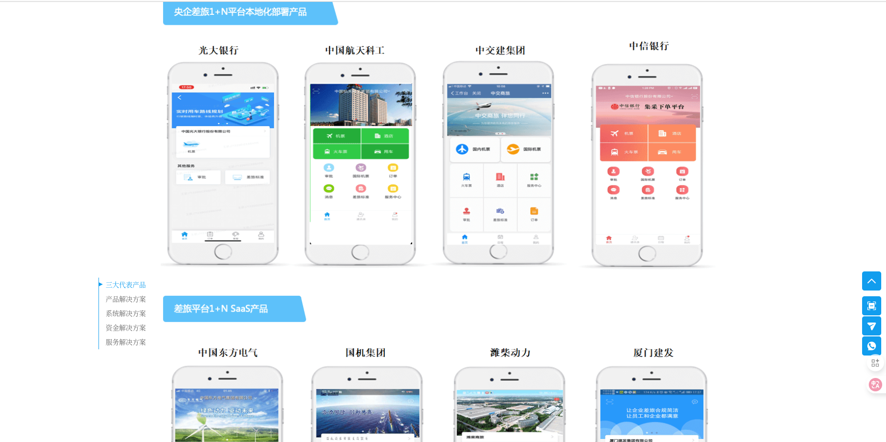
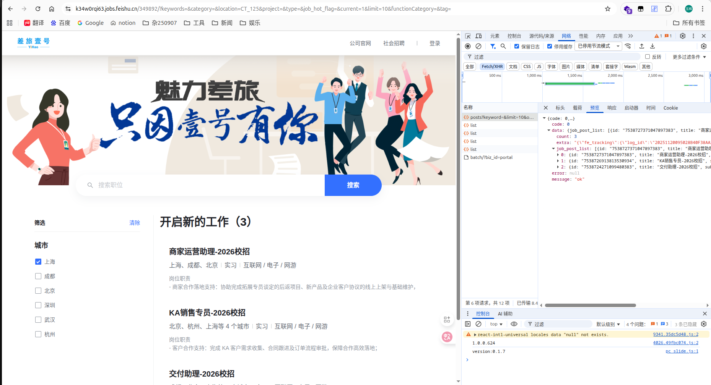
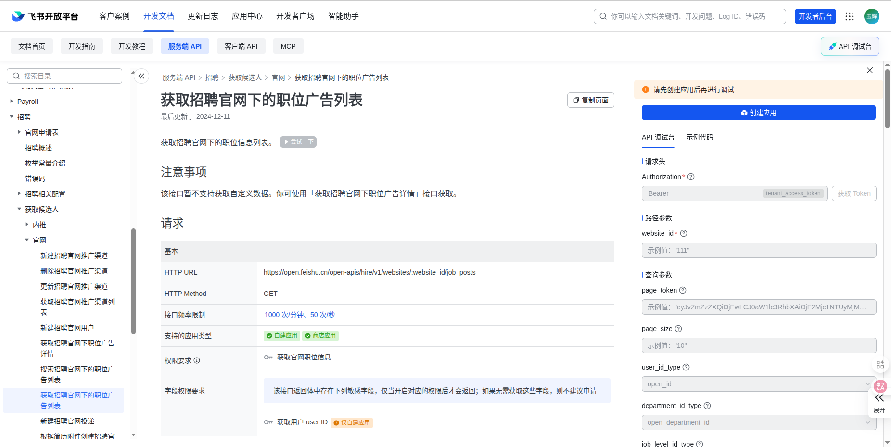
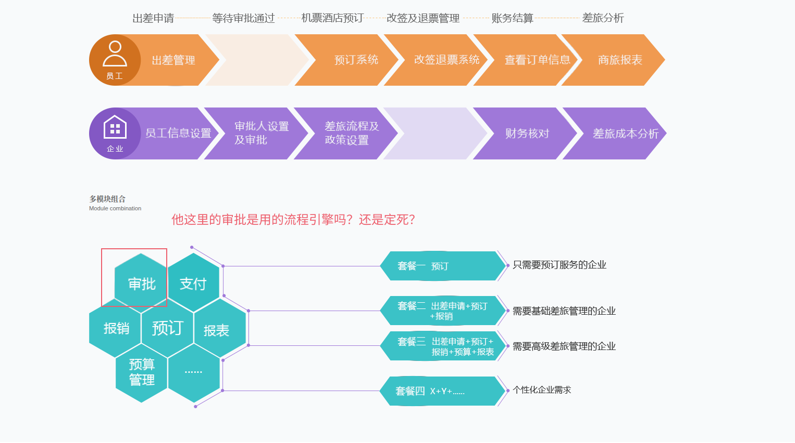

差旅壹号

这是一个主要业务是航班预定的平台
他的主要客户是央企
从主要航班预定业务扩展下来的是一个企业用的机票、财务审批的解决方案

一开始我是看到他的招聘信息产生疑惑的

- 负责国际机票核心交易系统（搜索、报价、预订）的架构设计、技术选型与核心代码开发。
- 主导与国际外部系统（GDS、航司、支付）的高效、稳定对接，设计全球容灾方案。
- 攻克分布式长事务、海量实时数据计算、全球数据一致性等极端技术挑战。
- 负责系统性能调优与稳定性治理，保障全球用户的流畅体验。
  职位要求：
- 计算机相关专业本科及以上学历，3年以上Java开发经验，3年以上大型分布式系统设计经验。
- 精通微服务架构、分布式缓存、消息队列、分库分表等，对JVM原理有深刻理解。
- 有高并发、高性能系统设计和调优的成功经验，熟悉常见性能瓶颈及解决方案。
- 具备强烈的技术好奇心、攻坚精神和系统化思维能力，乐于挑战技术难题。
- 有跨境业务、国际支付、复杂规则引擎系统经验者优先。

我好好看了下他的[官网](https://www.517la.com/userVue/#/)，我有几个问题

1. 航班业务到底是怎样的系统？怎么做的？
2. 他的审批流程是怎么做的？一个审批流
3. 他做了本地部署与sass

**本地化部署与sass集成**

这个和我们公司一样，就是不知道他们的做法是不是会更规范便于管理，毕竟是更大的公司，规范应该比我们公司要更好不然根本管理不了

**飞书招聘**

一开始单看接口还以为是通过api做的一个页面，我还专门找到了这个接口，没想到原来是直接用的飞书的页面

**收获**

- 明白了旅行社系统的核心功能（和GDS的对接）