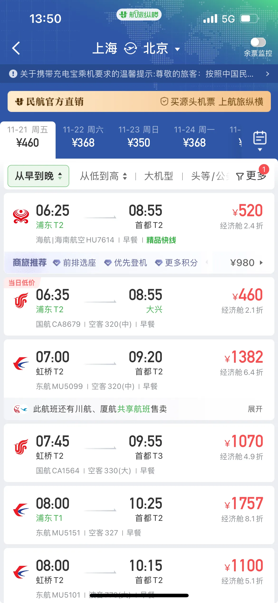
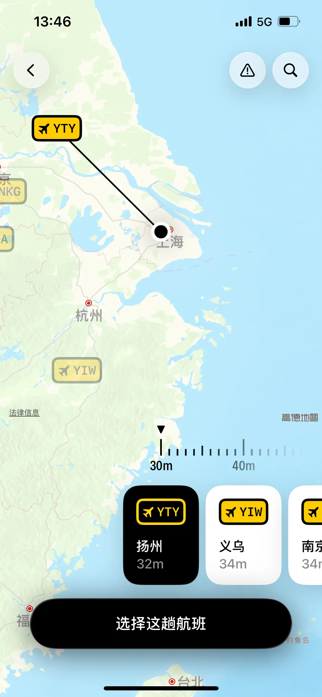

**旅行社系统（OTA）**

这个系统很难，技术难点有很多
- GDS对接
- 海量数据实时计算：数万家航空公司的航班班次、票价（不同舱位、折扣规则）、座位库存（每秒都在变化）、准点率等。Apache Flink
- 分布式长事务：库存、票价、支付多个微服务
- 高并发：超卖、雪崩
- 搜索：数据缓存
- 国际支付：

每一个都是技术难点，了解了他的业务，就看怎么用技术去解决

**业务要点**

**参考**
- 专注飞机
  - 是在手机上的地图+机场信息来构建自定义航班
- 航旅纵横
  - 两点搜索得出航班

**GDS对接**

GDS（全球分销系统）是机场为了更好的卖机票而制作的信息库与搜索引擎，在中国有TravelSky（中国民航集团）

OTA（在线旅行社）就是指携程、差旅壹号这样对接了GDS，给c端提供机票信息的公司

问ai说个人对接不了我还以为不行，后面再搜搜发现了这个[GDSapi对比](https://www.explinks.com/blog/airline-flight-booking-apis-gdss-specialized-data-providers-otas-and-metasearch-engines/)[Amadeus api文章](https://blog.csdn.net/dsndnwfk/article/details/142749856)，突然想起之前听博客有人做了一个航班专注软件，进官网才发现应该可以个人申请

这里面还提到了[langchain](https://docs.langchain.com/)之后也看一下

# 三大类航班API详细比较

| 类别 | 核心角色 | 代表厂商 | 数据来源 | 商业模式 | 优势 | 劣势 |
| :--- | :--- | :--- | :--- | :--- | :--- | :--- |
| **1. GDS API** | **全球分销骨干**，提供**完整的预订能力** | Amadeus, Sabre, Travelport, Travelsky（中国）等 | 直接连接数百家航空公司，**数据最权威、最实时** | **按请求收费** + **每笔预订的佣金**。价格需根据需求定制。 | - **功能最全面**（查询、预订、支付、辅营服务） - **实时库存和价格** - **行业黄金标准**，覆盖绝大多数传统航空公司 | - **集成和商业模式相对复杂** - 对低成本航空公司覆盖可能不足 - 成本结构可能对小企业较高 |
| **2. 技术服务商 API** | **专业数据提供者**，提供**增值数据或聚合接入** | **ATPCO（Routehappy）**：深度票价和机舱设施数据 **FlightStats/OAG**：航班状态、准点率、历史数据 **HitchHiker/eTravos**：聚合多个GDS和航空公司的统一API | 聚合GDS和航空公司的数据，并进行增强 | 通常**按请求收费**或收取技术服务费。 | - **提供GDS标准API之外的特色数据**（如座椅间距、Wi-Fi信息、准点率） - 有些提供**统一API**，简化多GDS接入 - 数据更具洞察力（如票价预测） | - **通常不提供完整预订引擎**，需与GDS API配合 - 数据可能非最实时，稍有延迟 |
| **3. 元搜索/OTA API** | **面向消费者的聚合器**，提供**搜索与比价能力** | Skyscanner, Kiwi, Travelfusion, momondo | 聚合来自GDS、航空公司官网、其他OTA的数据 | 通常通过**联盟计划**，**免费接入**，通过流量或成功预订**收取佣金**。 | - **简单易用**，集成快速 - **非常适合构建搜索和比价功能** - **初始成本低**，适合初创公司或小型项目 - 对**低成本航空公司**覆盖较好 | - **功能相对有限**，主要用于搜索和价格比较，预订功能可能受限 - 数据是聚合后的，可能不如GDS实时 - 定制化程度较低 |

## 核心关系总结

这三类API构成一个**分层的生态系统**：

1. **GDS API**是**核心枢纽**，直接从航空公司获取最权威的实时数据
2. **技术服务商API**是**专业补充**，提供GDS标准API之外的增值数据
3. **元搜索/OTA API**是**聚合零售商**，提供经过预处理的消费者级数据

