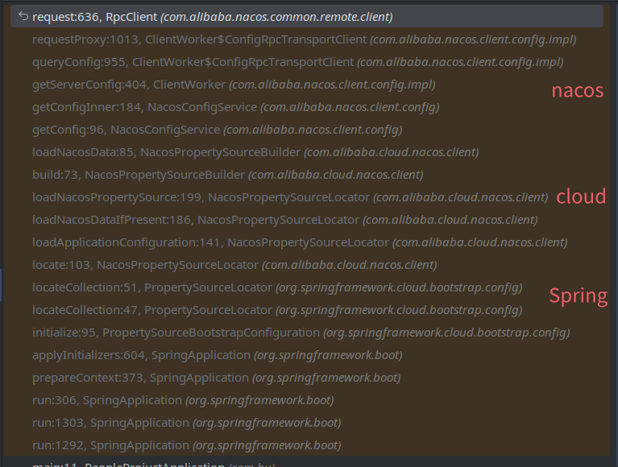

我以前在公司本地起服务时，控制台有时总是爆出nacos的连接超时，但是过一会就好了，以前觉得就是网络波动，但我老师会遇到所以现在还记得，这次就看看源码来看看到底是哪个地方爆出来的

首先先大致说一下结构，使用nacos时，可以分为nacos客户端和nacos服务端，服务端本质就是一个Spring Boot服务，
使用方式就是把服务端起起来，然后目标服务引入Spring Cloud nacos依赖，通过Spring的自动装配从而执行nacos-client连接服务端的代码从而达成在服务启动的时候去自动连接

这里的顺序可以看成：nacos服务端<-nacos客户端<-Spring Cloud nacos<-目标服务

看了会源码和文档了解了项目背景和设计理念，后面用断点调试来做分析

在基础的Spring Boot服务引入`spring-cloud-starter-alibaba-nacos-discovery（服务发现）`和`spring-cloud-starter-alibaba-nacos-config（配置管理）`两个依赖，配置文件问题考虑引入`spring-cloud-starter-bootstrap`

配置好nacos连接信息、加上`@EnableDiscoveryClient`服务发现注解就能启动报nacos连接错误

在错误信息位置打上断点就能发现
1. 错误位置在RpcClient.request方法上
2. 是满足了this.currentConnection == null条件才b报出NacosException异常的
3. 堆栈大致分为nacos、cloud、spring三个部分

按照之前说的可以找到第一个cloud的类是`NacosPropertySourceLocator`，它是config里的包并且继承了`PropertySourceLocator`，他的执行来自`NacosConfigBootstrapConfiguration`中的bean注入

## 收获
1. 这次看了这个异常的触发位置，下次再看到就能联想他的工作原理，不会盲目的忽略它
2. 初次看了nacos的源码，从源码层面了解了nacos的构成
3. 自动装配调用核心代码的逻辑适合其他集成到Spring项目的第三方源代码

## 参考
- [nacos项目地址](https://github.com/alibaba/nacos)

